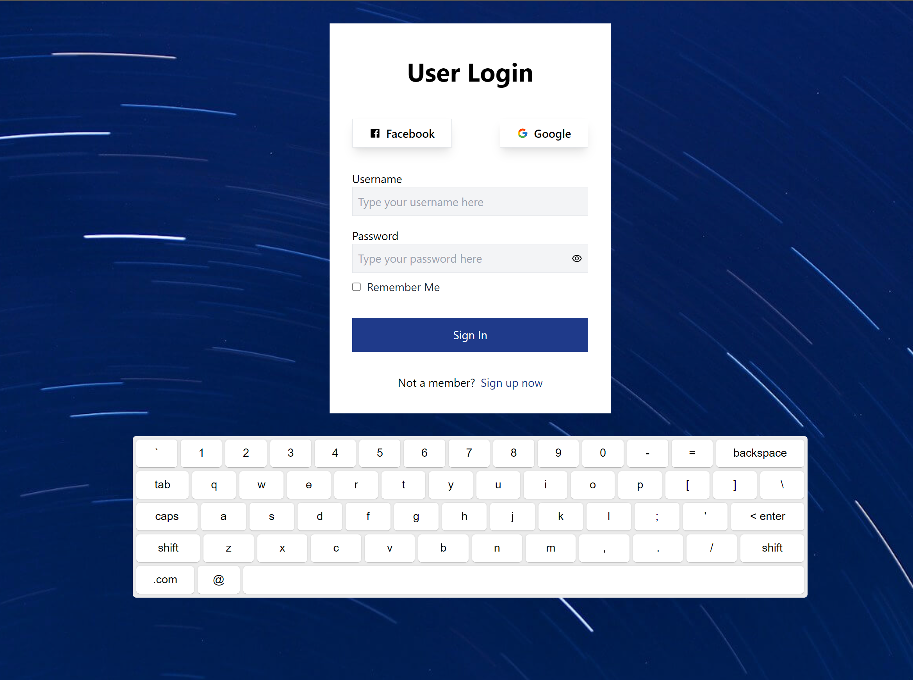
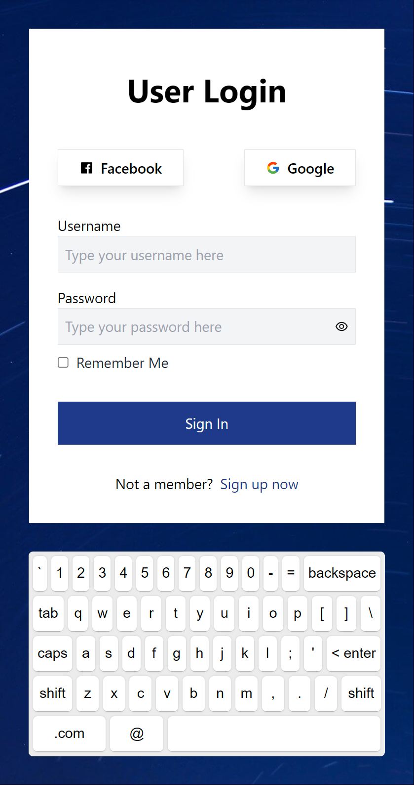

<div  align="center">


</div>


<h1  align="center">

🖥 Simple Register Form using React & Tailwind 📱

</h1>


## 🗃 Project

This React-based user login page project features custom input components for username and password, social media login options via Facebook and Google, a password visibility toggle, and a "Remember Me" checkbox. The form includes input validation and submission, with simulated backend interaction. The page is designed responsively, integrating an on-screen keyboard for user input.

</br>


## 🛠 Technologies

This project was developed with the following technologies:

   **JavaScript**

   **React**


   **TailwindCSS**


</br>


## 💻 Demonstration


<h5 align="center"> 🔗 Online: https://react-login-form-gmartinsdev.vercel.app </h5>

</br>
<p  align="center">
  <h5 align="center">🖥 Desktop:</h5>
  <kbd>

</kbd>
</p>
  <h5 align="center">📱 Mobile:</h5>
<p  align="center">
<kbd>

</kbd>
</p>

</br>

## 🚀 How to run

If you want to run the project on your local machine, just follow the steps below:

```bash
$ git clone https://github.com/gmartins-dev/react-login-form

# Install the dependencies

$ yarn install or npm install or pnpm install (recommended)

# Run FE app

$ yarn run dev or npm run dev or pnpm run dev (recommended)


```
## 🛠 Possible improvements and new features:


1. Form:

  1.1 use masks and validations

  1.2 maybe use a third library like:  Formik or React Hook Forms

  1.3 implement the social login functionality

  1.4 implement a recovery password option

2. Implement tests:

  2.1 unit tests

  2.2 integration tests

  2.3 end-to-end test


</br>

## 📝 License


This project is licensed under the MIT license.


</p>


</br>
<hr/>
</br>


<h3> Guilherme Martins - @gmartins-dev </h3>

- Portfolio: https://gmartins.dev

- LinkedIn: https://www.linkedin.com/in/gmartins-dev

- GitHub: https://github.com/gmartins-dev

- Email: contact@gmartins.dev
